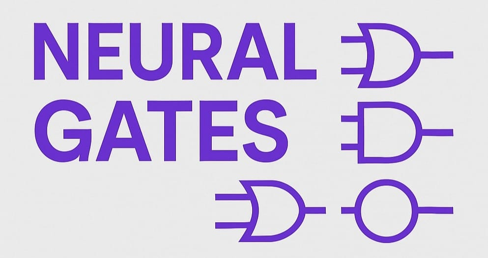

# Neural-Gates



This project is about using neural networks to act like logic gates and digital circuits. I built it in Python to see if I could make a neural network do the kind of binary logic you find in computer hardware, like AND gates or adders. It's a cool mix of machine learning and digital electronics, and I learned a ton while messing around with it.

What's It About?

## The idea is simple:

train neural networks to copy how logic gates work. A logic gate takes inputs (0s and 1s) and gives an output based on some rule—like AND outputs 1 only if both inputs are 1. I started with basic gates, then combined them to make circuits like half adders and full adders, and eventually built a 4-bit adder. The neural networks learn to approximate these rules by adjusting their weights during training.

## Tiny Architecture

Each logic gate uses a simple neural network with:

- 2 input neurons (for the binary inputs)
- 3 hidden neurons (2 for OR/NAND operations, 1 for AND)
- 1 output neuron (for the final result)
- tanh activation function for smooth learning

## Some cool stuff i build with it:

- Neural networks learning to behave like AND, OR, XOR gates
- A half adder that can add two binary numbers
- A full adder that can handle carry bits
- A 4-bit binary adder that can add numbers up to 15!

## Installation

```bash
# Clone the repo
git clone https://github.com/xtrupal/neuralGates.git
cd neuralGates

# Install the requirements
pip install matplotlib

# Run the demo
python demo.py

```

seeyaa :P
